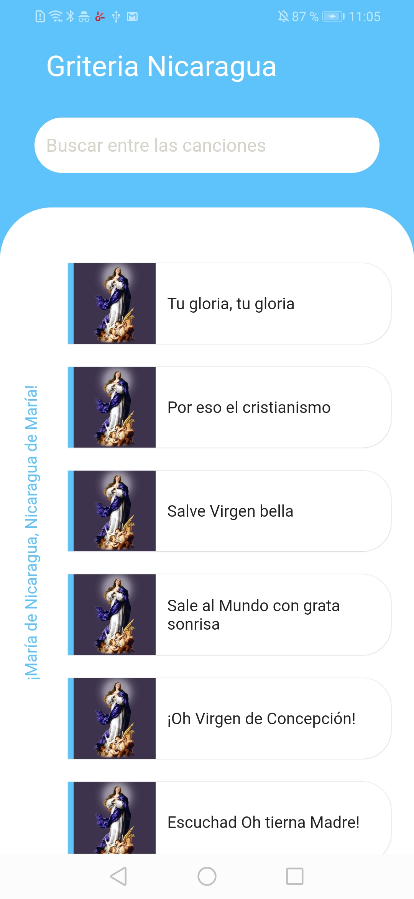
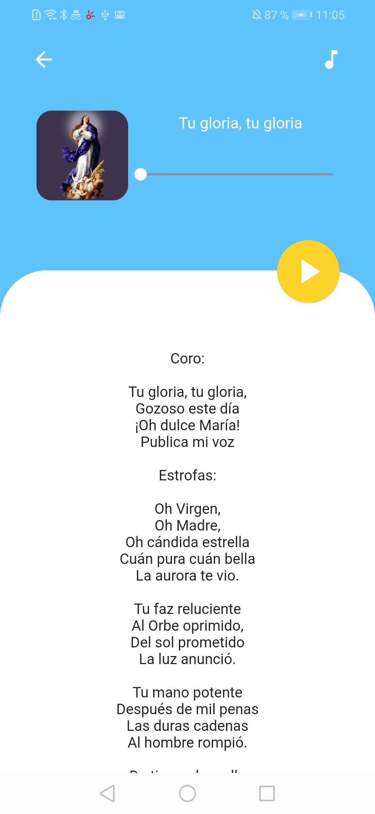

# Griteria Nicaragua Flutter

This project is an updated version of my old project Griteria Nicaragua created in Kotlin, now i created a new version in Flutter with an improvment in the UI Design,
because I was looking for ideas to practice my Flutter skills.

## Screenshots 

